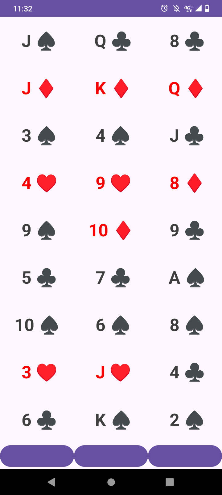
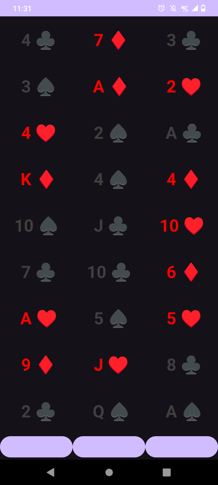

# 27 Cards
### Simple adaptation of classic Twenty-One Card Trick, 11th Card Trick or Three Column Trick

Random cards = [ 27 ]  
Each card has rank and suit (of 52 possible)

Each card is also randomly assigned unique column-order delineation (exactly 27)  
e.g., 1 1 1, 1 1 2, 1 1 3, 1 2 1, 1 2 2, 1 2 3, 1 3 1 ... 3 3 1, 3 3 2, 3 3 3

Three times the cards are laid out, in three columns according to their 3-digit plan  
Each time, mix the order so their rows aren't laid out in a pattern  
And each time, prompt for which column

Return the card whose 3-digit plan matches to the chosen columns

### To Do

icon

image size, order

publish

