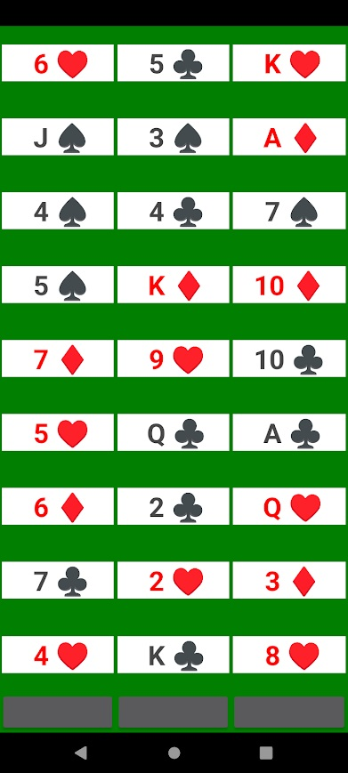

# 27 Cards
### Simple adaptation of classic Twenty-One Card Trick, 11th Card Trick or Three Column Trick

## Trick

In the original classic, the magician lays out three columns of seven cards each, face up, for a total of 21

He'll ask the volunteer to look and choose a card in her mind. He'll ask her to tell him only which column the card is in

The magician will collect the 21 cards, shuffle, and lay them out again like before

Again, he'll ask the volunteer which column her card is in

And again, he'll then mix up the cards and ask for the column one more time

He'll reveal exactly which card it was that she chose

&nbsp;  
This can be performed the same way with 27 cards

## Pseudocode

Random cards = [ 27 ]  
Each card has rank and suit (of 52 possible)

Each card is also randomly assigned unique column-order delineation (exactly 27)  
e.g., 1 1 1, 1 1 2, 1 1 3, 1 2 1, 1 2 2, 1 2 3, 1 3 1 ... 3 3 1, 3 3 2, 3 3 3

Three times the cards are laid out, in three columns according to their 3-digit plan  
Each time, mix the order so their rows aren't laid out in a pattern  
And each time, prompt for which column

Return the card whose 3-digit plan matches to the chosen columns

### To Do

publish

